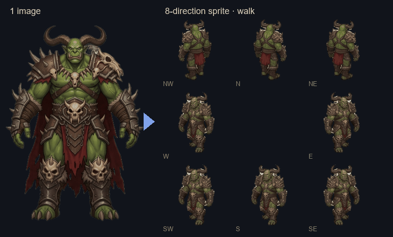
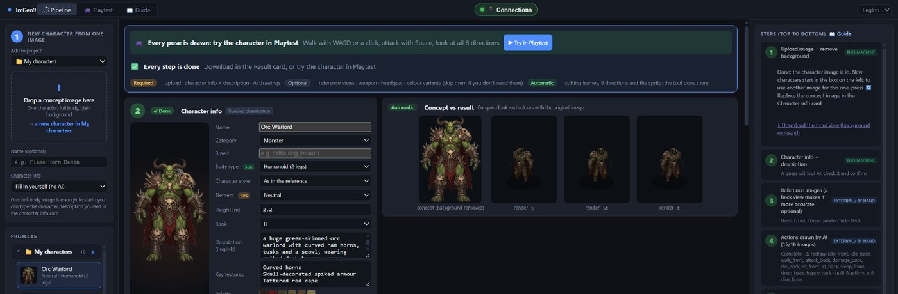
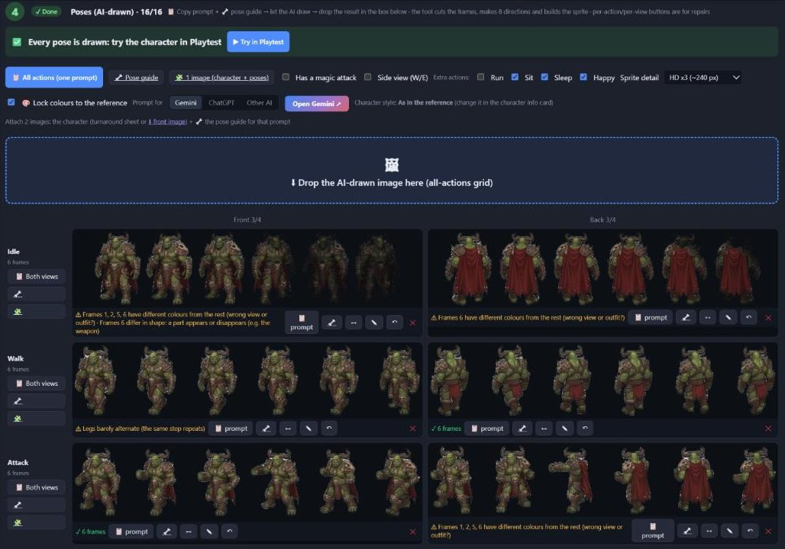
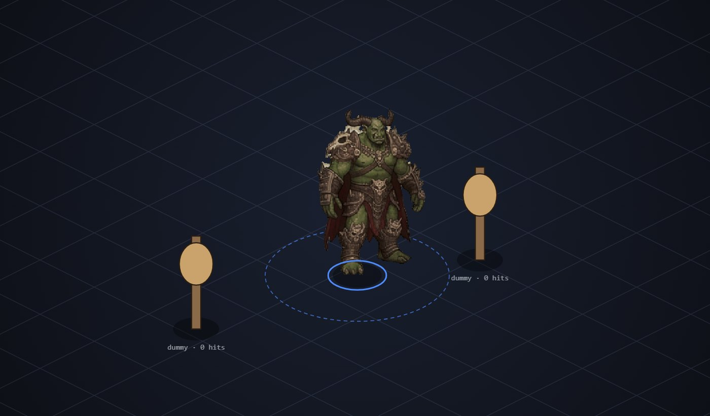
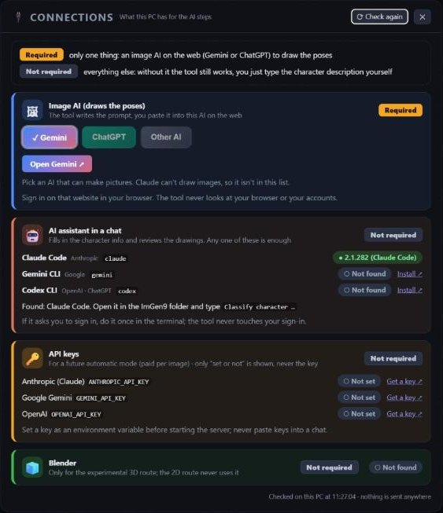
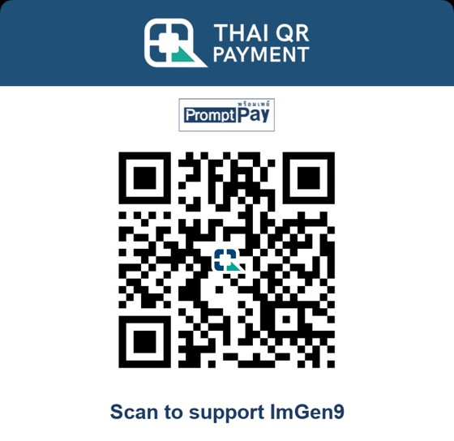

# ImGen9

**Character & monster sprite maker for 2D games.**

[](https://discord.gg/NwuzX3aZkP)
[](https://github.com/bjakapong416/imgen9/actions/workflows/ci.yml)
[](https://github.com/bjakapong416/imgen9/releases/latest)



Turn one character image into a game-ready, 8-direction 2D sprite: idle, walk, attack, hurt and
die, with an optional swappable weapon layer. You run it on your own PC. It writes a texture atlas +
JSON for web games (PixiJS / Phaser) and `.spr` / `.act` files.

> **Status: pre-release (v0.x).** It works end to end. The interface is in English and Thai (switch in
> the top bar), and a built-in **📖 Guide** tab walks you through every step.

## How it works

| Pipeline: one card per step | The AI-drawn poses, checked row by row |
|---|---|
|  |  |
| **Playtest:** walk with WASD, attack a dummy | **🔌 Connections:** what you need, and what you don't |
|  |  |

<sub>The orc was made with ImGen9 from the maintainer's own concept image; it is not part of the tool.
See the attack too: [orc_attack_8dir.gif](docs/images/orc_attack_8dir.gif).</sub>

The tool doesn't draw. Your own image AI (Gemini, ChatGPT, ...) does the drawing, from prompts the
tool writes. The tool does the tedious parts around it:

1. **Upload** one character image, or a turnaround sheet (front / 3/4 / side / back). The background
   is removed and the views are split.
2. **Copy one prompt** plus a stick-figure **pose guide** image. Paste both, with your character
   image, into your image AI. It draws every action as one 10 × 6 grid.
3. **Drop the result back.** The tool cuts the frames, flags bad rows (wrong frame count, size
   wobble, legs that don't alternate), lines the feet up and mirrors the two drawings (front 3/4 and
   back 3/4) into 8 directions.
4. **Preview** walking and attacking in **Playtest**, then **download**: frames, GIF, a zip, or the
   web-game bundle. The same atlas also comes as a Godot 4 `SpriteFrames` (`.tres`) and as
   Aseprite sprite-sheet JSON (frame tags per action and direction).

Characters are grouped into **projects** (one game or theme each). A project shares an art style,
a character style, sprite detail and a style reference image with all its characters, and downloads as one zip.

Optional: draw weapons on their own and lay them over every frame at the hand, so a game can swap
weapons of the same kind.

The **🔌 Connections** button (top bar) says what is required and what isn't. **Required:** an image
AI on the web (Gemini or ChatGPT). **Not required:** an AI assistant in a chat (Claude Code, Gemini CLI
or Codex, found on your PATH) that fills in the character info and reviews drawings, API keys, and
Blender. Everything is checked locally; it never looks at your browser or your sign-ins.

## Quick start

Requires **Python 3.11 – 3.13** and git.

```bash
git clone https://github.com/bjakapong416/imgen9.git
cd imgen9
```

- **Windows:** double-click `run.bat`.
- **macOS:** double-click `run.command` in Finder (the first time, if macOS refuses to open it: right-click → Open),
  or run `sh run.sh` in Terminal. The `python3` that comes with macOS is usually too old: install Python 3.12 from
  [python.org](https://www.python.org/downloads/macos/) or with Homebrew (`brew install python@3.12`). `run.sh`
  finds it by itself. Apple silicon and Intel Macs both work.
- **Linux:** `sh run.sh` (install `python3.12` and `python3.12-venv` first if your distribution doesn't have them).

No git? Download the zip from the [latest release](https://github.com/bjakapong416/imgen9/releases/latest),
unzip it and start it the same way.

The first run creates `.venv` and installs the packages (a few minutes). Then it opens
<http://127.0.0.1:8000>. The first background removal downloads a ~180 MB model once (to
`~/.rembg/models`, or `$U2NET_HOME`), so that upload takes longer.

Manual setup:

```bash
python -m venv .venv
.venv/bin/python -m pip install -r requirements.txt      # Windows: .venv\Scripts\python
.venv/bin/python -m uvicorn main:app --port 8000
```

Docker: `docker compose up --build`. Downloaded models stay in a named volume; `projects/` and `renders/`
are folders next to the compose file. The image covers the 2D route (no Blender). To bake the model
into the image instead: `docker build --build-arg PRELOAD_MODEL=1 -t imgen9 .`

## Tabs

| Tab | What it's for |
|---|---|
| **Pipeline** (start here) | Projects of characters: upload, describe, copy prompts, drop the AI drawings back, weapons, results and downloads |
| **Playtest** | Walk your characters with WASD or by clicking, attack training dummies, see all 8 directions at once, check foot sliding, swap weapons |
| **📖 Guide** | Every step explained, in English and Thai |

The **🔍 Frame by frame / GIF** button in a character's result card opens the Sprite Inspector view:
each action frame by frame (layers, origin, anchors, events) with single-frame, strip and GIF downloads.

## Known limitations

- Playtest and the frame-by-frame view are in English only; the Pipeline and the guide are English and Thai.
- Skill effects (fireballs, auras) are not part of this version.
- **Describing the character:** the prompts start with an English description of your character.
  You type it in the **Character info** card. Optionally an AI assistant fills it in, in a chat
  (Claude Code, Gemini CLI or Codex; see `CLAUDE.md`, "classify a character"), or with your own `ANTHROPIC_API_KEY`
  (`pip install -r requirements-optional.txt`; each call is billed to you).
- Characters are drawn by an external AI. Results vary, and some rows usually need a redraw. The
  per-row prompts are there for that.
- The optional 3D route (Blender, Hunyuan3D) is experimental and off by default.

## Your images and your sprites

- Use images you made yourself or have the rights to. Don't use screenshots of other people's art.
- ImGen9 claims no rights in your images or in the sprites you make. Whether AI-made images can be
  owned or protected depends on your country's law and on the AI service's terms, so check both
  before you sell assets. Some stores (such as itch.io) ask you to disclose AI use.
- The tool's prompts describe a look in plain words and never name other games or artists. Keep it
  that way when you edit them.

## Configuration (environment variables)

| Variable | Default | Purpose |
|---|---|---|
| `REMBG_MODEL` | `isnet-general-use` | Background removal model. Also: `u2net`, `isnet-anime` (stylised art), `u2netp` (small, fast) |
| `REMBG_POST_PROCESS` | `false` | Smooths mask edges, but can erase thin details such as swords and staves |
| `ALPHA_THRESHOLD` | `8` | Pixels with alpha at or below this count as empty when trimming |
| `MAX_UPLOAD_MB` | `25` | Maximum upload size |
| `MAX_IMAGE_PIXELS` | `67108864` | Maximum decoded pixel count (8192²) |
| `PRELOAD_MODEL` | `false` | Load the model at startup instead of on the first upload |
| `PROJECTS_DIR` | `./projects` | Your projects: `<project>/<character>/` with concept, cutout, profile, drawings, weapons |
| `RENDERS_DIR` | `./renders` | Built sprites (`<project>/<character>/sprite/`); Playtest reads them |
| `CACHE_DIR` | `./.cache` | Generated texture atlases. Safe to delete |
| `ANTHROPIC_API_KEY` (or `ANTHROPIC_AUTH_TOKEN`) | unset | Optional: classify with the Claude API (paid per call) |
| `BLENDER_PATH` | auto-detected | Optional 3D route: Blender executable |
| `AUTO_LOCAL_3D`, `HUNYUAN_PYTHON`, `MAX_MODEL_MB` | off | Optional, experimental local image-to-3D. Install Hunyuan3D-2 yourself and set `HUNYUAN_PYTHON` to its Python; its licence excludes the EU, UK and South Korea |

## Project layout

```
main.py                     FastAPI app: routes, static mounts
core/sprite2d.py            2D route: prompts, grid cutting, checks, 8-direction sprite build
core/pose_guide.py          stick-figure pose guides + hand positions per frame
core/weapons.py             weapon types, weapon layer placement
core/projects.py            characters: steps, uploads, builds, exports; projects (groups)
core/layout.py              where projects, characters and their sprites live on disk
core/web_bundle.py          atlas + JSON bundle for web games
core/spr_act.py             .spr / .act readers and writers
core/sprite_library.py      the built sprites: index, texture atlases, shared "animset" JSON
core/image_processing.py    background removal (rembg) + trimming
core/classify.py            image -> profile (Claude, optional) or heuristic fallback
static/js/pipeline/         Pipeline tab (pipeline.js, weapons.js)
static/js/lab/              Playtest
static/js/inspector/        frame-by-frame view (Sprite Inspector)
blender/                    optional Blender scripts (GPL-3.0-or-later)
tools/ai_tasks.py           classify + art-review helper for AI assistants (Claude Code, Gemini CLI, Codex)
```

More detail (both in Thai): [docs/ONE_IMAGE_TO_GAME.md](docs/ONE_IMAGE_TO_GAME.md) and
[docs/PIPELINE.md](docs/PIPELINE.md) (the optional 3D route).

## Support ImGen9

ImGen9 is free and open source. If it saves you time, you can support its development (the ❤ Support button in
the app shows the same):



**Thai PromptPay:** scan with any Thai banking app and choose the amount. Outside Thailand: an international
option is coming; until then a ⭐ star and telling other game makers helps a lot.
Support is a thank-you for the work so far: it doesn't buy features or priority support.

## Community and help

- **💬 Discord:** [discord.gg/NwuzX3aZkP](https://discord.gg/NwuzX3aZkP) — ask questions, report a problem, show your characters, or say what
  you'd like to build.
- **Bugs:** open an [issue](https://github.com/bjakapong416/imgen9/issues/new/choose) (there's a form).
- **Ideas and show & tell:** [Discussions](https://github.com/bjakapong416/imgen9/discussions).
- **Security problems:** please report them privately, see [SECURITY.md](SECURITY.md).
- Be kind: [CODE_OF_CONDUCT.md](CODE_OF_CONDUCT.md).

## Contributing

See [CONTRIBUTING.md](CONTRIBUTING.md). Contributions need the Contributor License Agreement in it. Not sure where
to start? Ask on [Discord](https://discord.gg/NwuzX3aZkP).

## Licence

Copyright © the project maintainer.

- Code: [GNU AGPL-3.0-or-later](LICENSE).
- The Blender scripts in `blender/`: [GPL-3.0-or-later](blender/LICENSE).
- Dependencies and models: [THIRD_PARTY_LICENSES.md](THIRD_PARTY_LICENSES.md).
- ImGen9 is provided as is, without any warranty (see sections 15 and 16 of the [LICENSE](LICENSE)).

The `.spr`/`.act` sprite format is supported for compatibility only. This project includes no files
from any game and is not affiliated with any game publisher.
